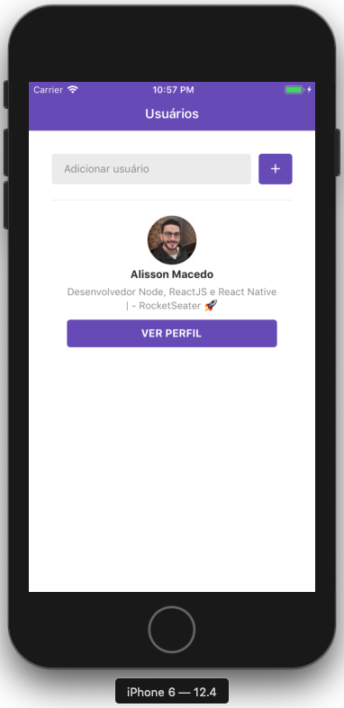

<h1 align="center">Bootcamp-React-Native-Favorite-Github</h1>

 - This app was developed during the course of RocketSeat using react-native. This app allows you to add People and list your favorite repositories.

## 💻  Register a profile

- You can add a github profile to be able to follow
  the repositories she has favorited;




## 💻  Register a profile

- You can listing the favorite repositories of the selected profile.


## 🎩 How it works

Install dependêncies
```sh
yarn
```
Run project
```sh
react-native run-ios
```
